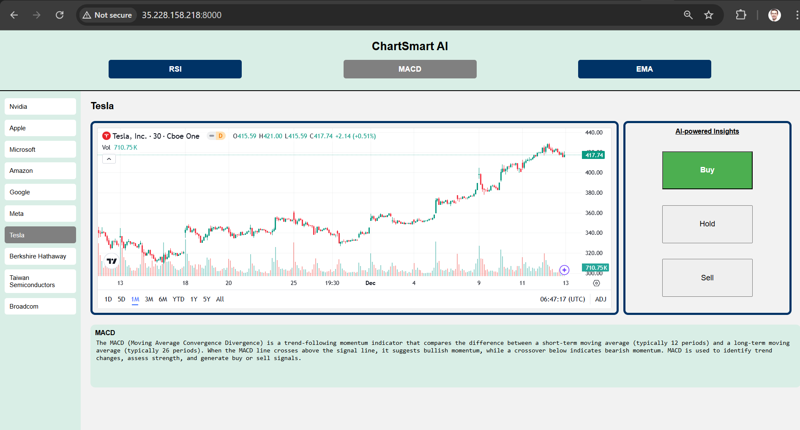
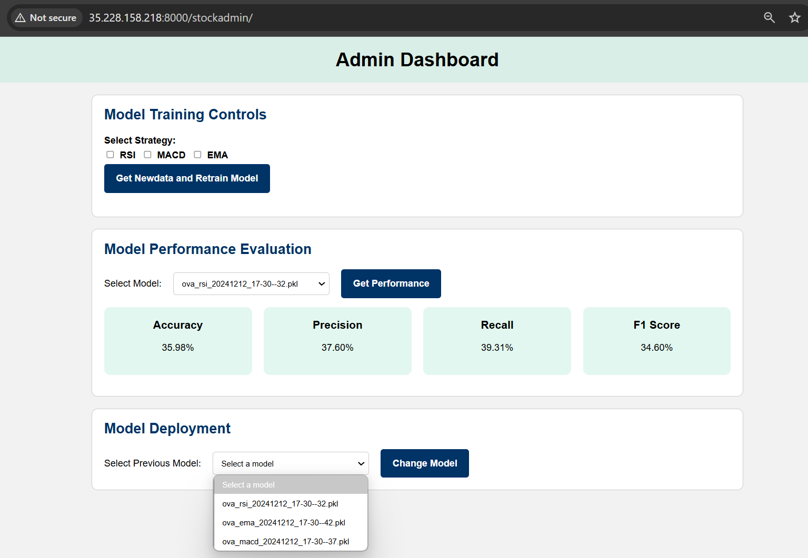

# Group 2 - Stock Market Prediction System

## Description
The system provides AI-powered stock analyses to give users valuable insights into stock market behavior and trends. The system leverages machine learning models trained on technical analysis strategies and future price movements to generate “buy”, “sell”, or “hold” recommendations for the top 10 stocks on the US market (according to market cap),  allowing users to explore and apply strategies in their own trading decisions. In addition, deep learning models are used to forecast future prices.

**Classification - One-vs-All**:
- RSI (Relative Strength Index)
- MACD (Moving Average Convergence/Divergence) model
- EMA (Exponential Moving Average)

**Regression - Time Series Forecasting:**
- RNN model 
- LSTM model

## Usage
The project is deployed via Google Cloud. Access the project using your favorite web browser:
```
http://35.228.158.218:8000/
http://35.228.158.218:8000/stockadmin
```

**User UI:**


**Admin UI:**


## Installation
**Prerequisites:** conda or python (recommended)
1. Fetch dependencies:

if using conda:
```sh
conda env create -f environment.yml
conda activate django-env
```
if using python (recommended):
```sh
python3 -m venv venv # create virtual environment
source venv/bin/activate # activate virtual environment
pip install -r stock_project/requirements.txt
pip install -r ml_pipelines/ema/requirements.txt
pip install -r ml_pipelines/macd/requirements.txt
pip install -r ml_pipelines/rsi/requirements.txt
pip install -r ml_pipelines/model_implementation/requirements.txt
```

2. Obtain ALPACA API key:
```
ALPACA_API_KEY=YOUR_API_KEY
ALPACA_SECRET_KEY=YOUR_SECRET_KEY
```
3. Create `.env` files as described in DIT826 google drive folder.
4. Start Django server:
```sh
python stock_project/manage.py makemigrations # apply changes to models
python stock_project/manage.py migrate # apply database migrations
python stock_project/manage.py runserver # run Django server
```
5. Run ML pipelines:
```sh
python ml_pipelines/ema/main_script.py # wait 60 seconds to fetch and process data, post to database
python ml_pipelines/macd/main_script.py # wait 60 seconds to fetch and process data, post to database
python ml_pipelines/rsi/main_script.py # wait 60 seconds to fetch and process data, post to database
python ml_pipelines/model_implementation main_script.py ema # wait 10 seconds to train, post pickle file and metaadata
python ml_pipelines/model_implementation main_script.py macd # wait 10 seconds to train, post pickle file and metaadata
python ml_pipelines/model_implementation main_script.py rsi # wait 10 seconds to train, post pickle file and metaadata
```
6. Access frontend for user and admin:
```
http://localhost:8000/
http://localhost:8000/stockadmin
```

## Deployment
## Kubernetes, Docker, and Google cloud cheat sheet
**Prerequisites:** Install kubectl, docker, and Google Cloud CLI

**Deployment Prerequisites:** Use free Google Cloud credits. Configure cloud services via Google Cloud Console, in particular, GKE and Container Registry.

### Google Cloud CLI commands
- Login: `gcloud auth login` (oauth with group2.dit826@gmail.com)
- Activate project: `gcloud config set project adroit-arcana-443708-m9`
- Install plugin to authenticate **kubectl** with **GKE**: `gcloud components install gke-gcloud-auth-plugin`
- Connect kubectl to cluster: `gcloud container clusters get-credentials stock-project-cluster --zone europe-north1`
- Authenticate docker with Google Cloud: `gcloud auth configure-docker`
### Docker commands
- Build docker image: `docker build -t <IMAGE_NAME> .`
- Tag docker image: `docker tag <IMAGE_NAME> gcr.io/<PROJECT_ID>/<IMAGE_NAME>:v1`
- Push docker image: `docker push gcr.io/<PROJECT_ID>/<IMAGE_NAME>:v1`
- Debug local docker image via terminal (if needed):
`docker run --rm -it <IMAGE_NAME> /bin/bash`
### Kubectl commands
- Check version and connection: `kubectl version`
- List pods: `kubectl get pods`
- List jobs: `kubectl get jobs`
- List services: `kubectl get services`
- List all contexts: `kubectl config get-contexts`
- Switch context: `kubectl config use-context <context>`
- Apply configuration to kubernetes yaml file: `kubectl apply -f <yaml file>`
- Delete pod: `kubectl delete pod <pod-name>`
- Delete job: `kubectl delete job <job-name>`
- Delete deployment (to stop K8s from recreating pods): `kubectl delete deployment <deployment-name>`
- Read logs from pod: `kubectl logs <pod-name>`
- Create terminal inside a K8s pod: `kubectl exec -it <pod-name> -- /bin/sh`

## Acknowledgements
The authors thank Daniel Strüber @danstru and the DIT826 teaching team for organizing the course. Special thanks to Yi Peng @yipe for supporting the project during weekly discussions.

## License
This project is licensed under the MIT License.

## Project status
**v1.0.0:** [MVP project](https://git.chalmers.se/courses/dit826/2024/group2/-/releases/v1.0.0)

## Contributors
- Mehmet Asim Altinisik @mehmetas
- Malte Bengtsson @bmalte
- Karl Eriksson @kaeriks
- Jessie Johnsson @jessiejo
- Isaac Lindegren Ternbom @isaacl
- Nasit Vurgun @nasit